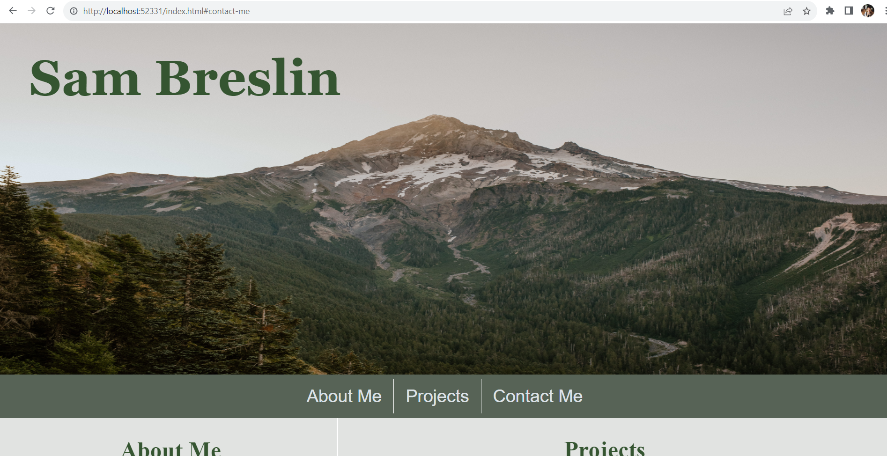

# S.Breslin-Portfolio

## Description

This repository contains code, both HTML and CSS, for a website that showcases my personal portfolio of work. It includes a short personal biography, links to some of my recent projects, and my contact information. The projects included help to detail the experience and knowledge base I have so far gained regarding several HTML and CSS topics. In writing the code for this portfolio I was able to demonstrate proper use of semantic HTML, basic styling techniques via CSS, and page responsiveness via media queries and flex displays. I found the flex displays to be the most challenging part of this project and look forward to honing this skill as I continue in the course. 

## Installation

N/A

## Usage

## Credits

This repository contains a standard reset css file that I sourced from the class's UNH GitLab respository.

## Links
https://sambrez.github.io/S.Breslin-Portfolio/#contact-me